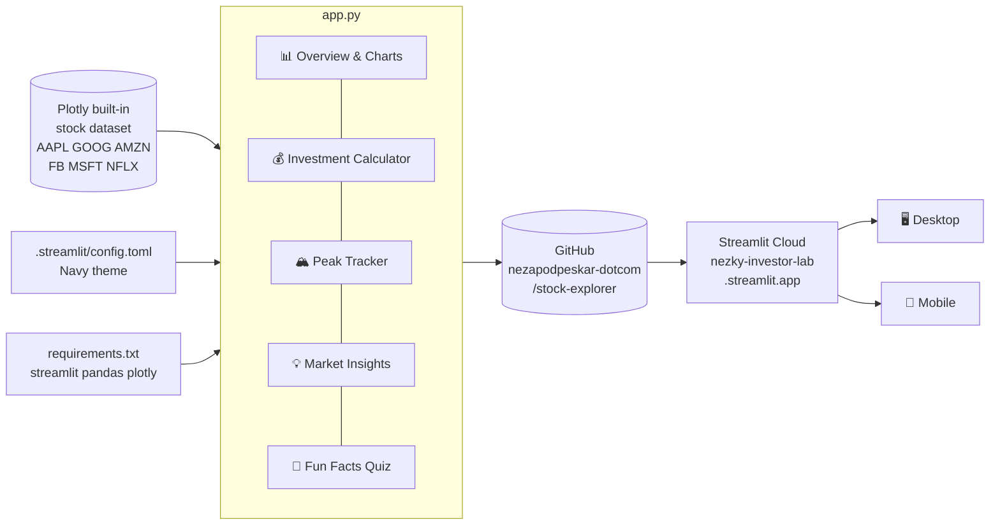
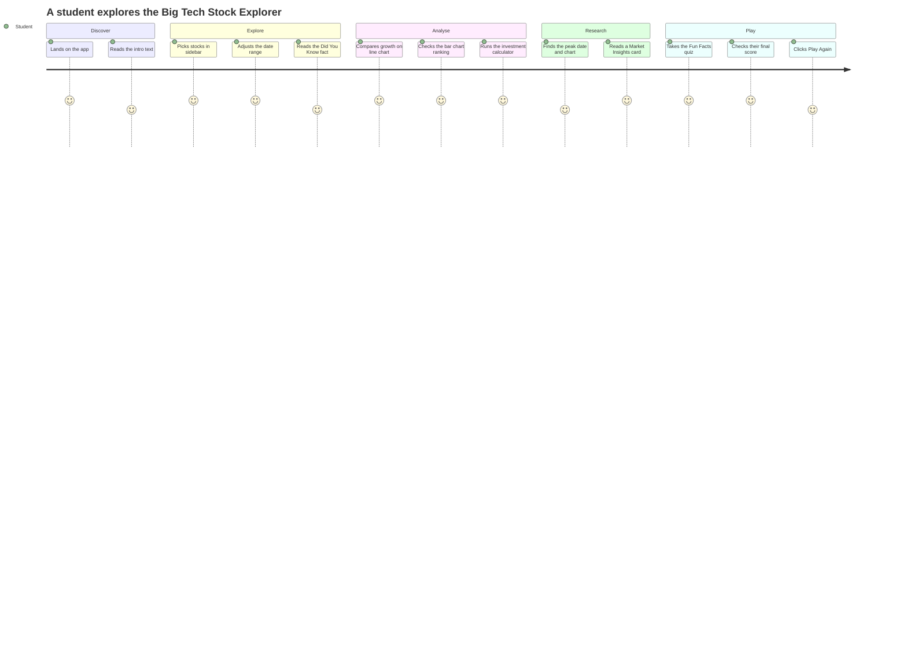
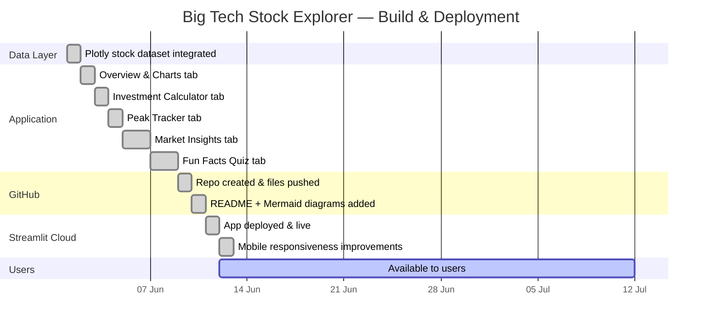

# 📈 Big Tech Stock Explorer

An interactive, business-school-ready stock market dashboard built with Python and Streamlit. Explore historical performance, run investment simulations, and test your Big Tech knowledge — all in one place.

---

## Business Context

Understanding how technology giants perform over time is a core skill in finance and strategy. This dashboard makes that analysis accessible: no Bloomberg terminal, no spreadsheets — just a browser. It was built as a milestone project to demonstrate data storytelling, interactive visualisation, and responsible use of AI-assisted development tools.

---

## Features

| Tab | What it does |
|-----|-------------|
| **📊 Overview & Charts** | Normalised price trends, total growth bar chart, best performer and most volatile highlights |
| **💰 Investment Calculator** | "What if I invested $X?" — shows end value, gain/loss, and contextual commentary |
| **🏔️ Peak Tracker** | Finds the exact peak date for any stock within the selected window, with a starred chart |
| **💡 Market Insights** | Curated business facts for Apple, Google, Amazon, Netflix, Meta, and Microsoft — sourced from official company pages |
| **🎯 Fun Facts Quiz** | 12-question True/False quiz covering Big Tech history; tracks your score with session state |

**Sidebar controls** — stock multiselect, date-range slider, and a daily-rotating "Did You Know?" company fact.

---

## Tech Stack

- **[Streamlit](https://streamlit.io)** — UI framework and deployment target
- **[Plotly Express](https://plotly.com/python/plotly-express/)** — interactive line and bar charts
- **[Pandas](https://pandas.pydata.org)** — data manipulation
- **Built-in Plotly stock dataset** — AAPL, GOOG, AMZN, FB, MSFT, NFLX (no API key required)

---

## How to Run Locally

**1. Clone the repo**
```bash
git clone https://github.com/nezapodpeskar-dotcom/stock-explorer.git
cd stock-explorer
```

**2. Install dependencies**
```bash
pip install -r requirements.txt
```

**3. Run the app**
```bash
streamlit run app.py
```

The app opens at `http://localhost:8501` (or the next available port).

---

## Project Structure

```
stock-explorer/
├── app.py                  # Main Streamlit application
├── requirements.txt        # Python dependencies
├── .streamlit/
│   └── config.toml         # Theme — navy primary, light background
├── .gitignore
└── README.md
```

---

## MCP Tools Used During Development

This project was built with **Claude Code** and three MCP skill packs:

| MCP Tool | How it was used |
|----------|----------------|
| **Fetch MCP** | Fetched official company pages (investor.apple.com, news.microsoft.com, abc.xyz, about.netflix.com, about.meta.com, nvidia.com) to source verified facts for the Market Insights and Fun Facts tabs |
| **GitHub MCP** | Created the public repository, pushed all project files, and committed incremental updates — all without leaving the AI assistant |
| **Context7 MCP** | Retrieved up-to-date Streamlit API documentation to ensure correct usage of `st.session_state`, `st.tabs`, `st.progress`, and theming |

---

## Deployment

This app is ready for **Streamlit Cloud**:

1. Fork or connect this repo at [share.streamlit.io](https://share.streamlit.io)
2. Set **Main file path** to `app.py`
3. No secrets or environment variables required

---

## Architecture



---

## User Journey



---

## Build & Deployment Timeline



---

## Data Note

Stock data comes from `plotly.express.data.stocks()` — a built-in sample dataset covering 2018–2019. Tickers available: AAPL, GOOG, AMZN, FB, MSFT, NFLX. All prices are re-indexed to 1.0 at the start of the user-selected date range so stocks can be compared on equal footing regardless of their absolute price.
